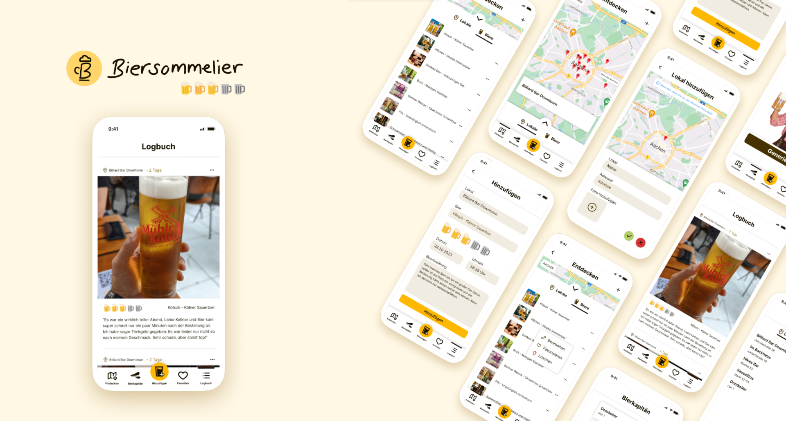

# Biersommelier

Eine App zum notieren von Bieren.



## Grund der App

Diese App wird während des dritten Semesters an der Fh-Aachen für das SWE Praktikum erstellt.

## Anforderungen

### Bauen

Die App benötigt [Flutter](https://flutter.dev/) sowie die Android SDK mit Mindestversion 33. Um diese komfortabel zu installieren kann [Android Studio](https://developer.android.com/studio) verwendet werden.

### Mobil

Die App benötigt eine Android Version von 11 oder höher oder die iOS Version 16 oder höher.

## Bauen der App

Die App kann auf Windows, Linux sowie Mac gebaut werden. Um eine Apk zu erstellen kann dieser Befehl genutzt werden

```bash
flutter build apk
```
